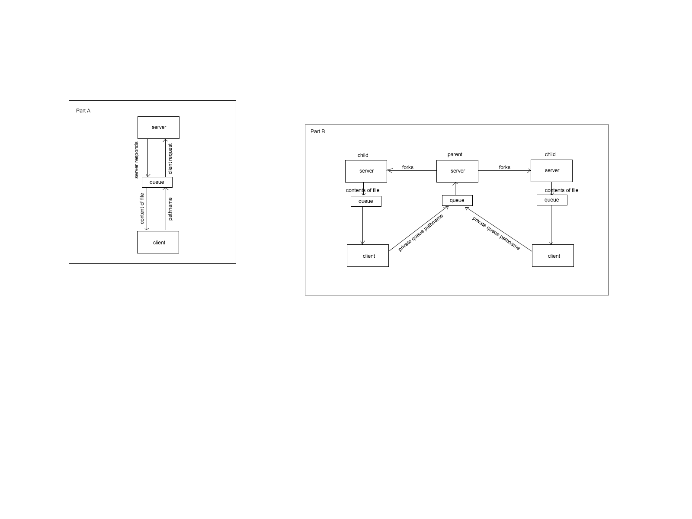

HOW TO TEST EACH PROGRAM

for part A -----------------------------------
run 2 terminals A & B

in terminal A navigate to /part1/
run ./server

in terminal B navigate to /part1/
run ./client

when client is running type stuff in terminal B
----------------------------------------------

for part B------------------------------------
run 3 or more terminals A B & C

in terminal A navigate to /part1/
run ./server

in terminal B navigate to /part2/
run ./client

in terminal C navigate to /part2/
run ./client

in terminal B and C type stuff----------------------------------------------

note on version current version:

priorities and threads on the client 
are not implemented yet

